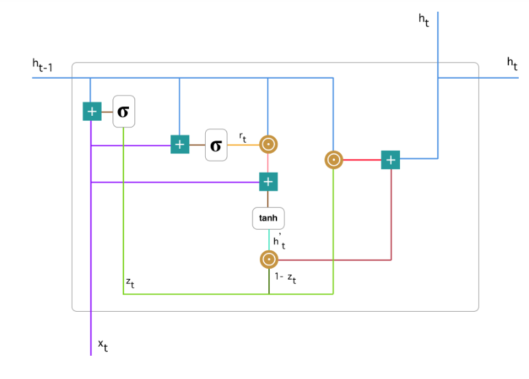
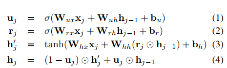

循环神经网络（Recurrent Neural Network， RNN）是处理序列标注任务的经典模型之一，被
广泛应用于中文分词、命名实体识别等任务中.

ROUGE-1 is a metric used in Natural Language Processing (NLP) and specifically in the field of text summarization and machine translation. It stands for "Recall-Oriented Understudy for Gisting Evaluation." ROUGE-1 evaluates the quality of a summary or translation by comparing it to one or more reference summaries or translations.

